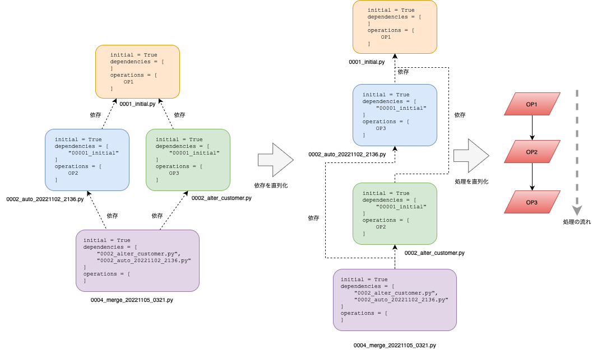
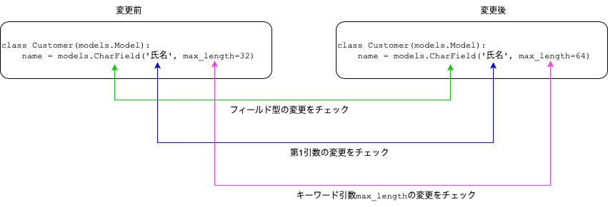

# Django Migration チュートリアル

## この発表の概要

* 目的: DjangoのMigration(以降単にマイグレーションと表記します)の基本的な使い方の解説
* 対象者: Django初心者・初級者

## あなた is だれ?

金子亮佑 (Ryosuke KANEKO) (a.k.a yamaneko)

### Work for

* Standard株式会社: Manager
* Artis株式会社: Backend & OPS Engineer

### Experiences

* 10+ years Django based app development
* 5+ years Django Rest Framework based API development
* 最初に触ったDjango -> 0.96
* (この半年はDjangoから離れて、大人の事情で赤い線路のフレームワークに触れてます、シュッシュッポッポッ🚃)

### Why Django(and DRF&DjangoFilter)?

**「最小のコードで多くの機能が得られる」**

* Model
* ModelForm
* GenericView
* Auth
* Admin
* [DjangoFilter] FilterSet
* [DRF] ModelSerializer
* [DRF] ModelViewSet

**「Modelsが全体のベースとなっている」**<br>
**「モデルとテーブルの同期も最小限のコストで機能的に行える」**

## マイグレーション is 何?

### 意味

* 一般的なスキーママイグレーションの意味
* Djangoのマイグレーション
* マイグレーションファイル(後述)に記述されたデータベースに対する操作

### Djangoのマイグレーション

- モデルの状態をマイグレーションファイルに記録しDB(RDBMS)のスキーマに反映させる仕組み
- データを変更させる仕組み
- これら2つを統合して管理する仕組み

### 詳細

- モデルに基づいたスキーマの反映・ロールバック(元に戻す)
- モデルの状態をVCSに保存
- Pythonコードを使用したデータの変更処理
- 開発・ステージング・本番を選ばず使用可能
- バックエンドを選ばず使用可能

<br>

## 歴史

* Django 1.6まで
  * ビルトインのマイグレーション機能 -> なし
  * `$ python manaage.py syncdb` -> テーブルを作るのみの機能(スキーマの変更は不可能)
  * サードパーティツールSouth[^1]
* Django 1.7から
  * ビルトインのマイグレーション搭載[^2]

[^1]: https://south.readthedocs.io/en/latest/
[^2]: https://south.readthedocs.io/en/latest/releasenotes/1.0.html#library-migration-path  

## 基本的ワークフロー

### モデルを作成する

例: ECサイトアプリを作ります．

まず顧客をモデルに定義します．

```python:ec_site/models.py
from django.db import models  
  
  
class Customer(models.Model):  
    name = models.CharField('氏名', max_length=32)  
    email = models.EmailField('メールアドレス')  
    postal_code = models.CharField('郵便番号', max_length=8)  
    address = models.CharField('住所', max_length=128)  
  
    class Meta:  
        verbose_name = '顧客'  
        verbose_name_plural = verbose_name
```

モデルの変更をマイグレーションファイルに記録する．

```bash
$ python manage.py makemigrations
```

**ec_site/migrations/0001_initial.py**というmigrationファイル(pythonファイル)が作られます．

マイグレーションファイルに記録されている変更をSQL文で確認する．

```bash
$ python manage.py sqlmigrate ec_site 0001_init
```

### 最初のマイグレーションファイルを適用する

まずマイグレーションとデータベースの状態を確認しましょう．

```bash
$ python manage.py showmigrations
$ echo "show tables;"  | python manage.py dbshell
```

マイグレーションファイルを元に，データベースに変更を加えます．

```bash
$ python manage.py migrate
```

データベースのテーブル状態を確認します．

```bash
$ python manage.py dbshell
MySQL [ec_site_devel]> show tables;
MySQL [ec_site_devel]> show create table ec_site_customer \G;
MySQL [ec_site_devel]> select * from ec_site_customer;
```

マイグレーションの状態を確認します.


```bash
$ python manage.py showmigrations
```

### モデルに変更を加える(カラムを追加する)

電話番号カラムを追加します．

```python:ec_site/models.py
from django.db import models  
  
  
class Customer(models.Model):  
    name = models.CharField('氏名', max_length=32)  
    email = models.EmailField('メールアドレス')  
    postal_code = models.CharField('郵便番号', max_length=8)  
    address = models.CharField('住所', max_length=128)  
    tel = models.CharField('電話番号', max_length=11, blank=True)  
  
    class Meta:  
        verbose_name = '顧客'  
        verbose_name_plural = verbose_name
```

```bash
$ python manage.py makemigrations
```

**ec_site/migrations/0002_customer_tel.py**というマイグレーションファイルが作られます．マイグレーションの状態を確認しましょう．

```bash
$ python manage.py showmigrations
```
  
マイグレーションファイルを元に，データベースに変更を加えます．

```bash
$ python manage.py migrate
```
  
マイグレーションの状態とテーブル状態を確認します．

```bash
$ python manage.py showmigrations
```

```bash
$ echo "show create table ec_site_customer \G;"  | python manage.py dbshell
```

### マイグレーションをロールバックする

適用したマイグレーションをロールバック(元に戻す)します．

まず、マイグレーションの状態を確認する．

```bash
$ python manage.py showmigrations
```

`0001_initial`の状態までロールバックします．

```bash
$ python manage.py migrate main 0001_initial
```

マイグレーションとデータベースの状態を確認します．

```bash
$ python manage.py showmigrations
$ python manage.py dbshell
MySQL [ec_site_devel]> show create table ec_site_customer \G;
```

### ここまでのポイント

* 開発者はモデルの定義のみ行う．テーブル・カラムの作成・変更・削除はマイグレーション機能が行う．
* モデル定義への変更はマイグレーションファイルとして記録される．
    * マイグレーションファイルはデータベースの状態を表すものではない．
* データベースに適用されたマイグレーションファイルの状態はデータベースに記録される．
    * ソースコードリポジトリはマイグレーションファイルの適用についての情報を持たない．
* データベースに適用されたマイグレーションをロールバックすることができる．

## 更に詳しく知る

### マイグレーションの状態の記録場所

`django_migrations`テーブルにマイグレーションの状態が管理されている．

```bash
$ echo "select * from django_migrations;"  | python manage.py dbshell
```

### マイグレーションファイルについて深く知る

#### ファイル名

`$ python manage.py makemigrations` によって自動的に命名される．

* 例1: `0001_initial.py`
* 例2: `0002_auto_20221102_1015.py`


4桁の通し番号の数字はフレームワークが自動的につけているので、目安程度の意味しかない．

#### ファイルの中の大まかな構造の説明

```python:0002_auto_20221102_1015.py
class Migration(migrations.Migration):

    dependencies = [('migrations', '0001_initial')]

    operations = [
        migrations.DeleteModel('Tribble'),
        migrations.AddField('Author', 'rating', models.IntegerField(default=0)),
    ]
```

* initial: このマイグレーションがアプリの最初のマイグレーションかを示すフラグ
* dependencies: 依存するマイグレーションファイル(複数選択可)
* operations: 操作(例だと，モデルの削除とカラムの追加)

operationsはある時点でのモデルの状態を状態を示します．
常に一意のデータとして解釈できるよう、状態を**シリアライズして**ファイルに保存します．

#### マイグレーションファイルとマイグレーション処理の関係

* マイグレーションはDjangoアプリごとに管理される．
* `dependencies`からマイグレーションの順を示したグラフ構造が示される．
  * `initial`がグラフの起点となる．
* `operations`からバックエンドに応じたクエリを生成する．
* `$ python manage.py migrate`を実行すると、グラフ構造に沿ってデータベースにクエリを実行する．

<br>

### マイグレーションファイルとVCSブランチ

複数人で開発を行う場合、マイグレーションのグラフが以下のようになる事があります．

<br>

この状態で`$ python manage.py migrate`すると以下のエラーが出ます．

```bash
$ python manage.py migrate
CommandError: Conflicting migrations detected; multiple leaf nodes in the migration graph: (0002_auto_20221102_2136, 0002_alter_customer in ec_site).
To fix them run 'python manage.py makemigrations --merge'
```

マイグレーションの依存のグラフに複数の葉(leaf)が出来ている状態ではマイグレーションは実行できません．
一つの葉になるようにマージします．

<br>

閉路が出来たグラフの場合、マイグレーションの直列化して処理を行います．

<br>

### シリアライズ

`$ python manage.py makemigrations`は現在のモデルと過去のモデルの状態を比較して変更を検出します．
検出された変更をシリアライズしてマイグレーションファイルに記録します．
シリアライズ可能なオブジェクトのみをモデル定義に含めることが出来ます．



* シリアライズ可能
  * int, float, bool, str, bytes, None, NoneType
  * list, set, tuple, dict, range.
  * datetime.date, datetime.time, and datetime.datetime instances (timezone-awareなdatetimeを含む)
  * decimal.Decimal インスタンス
  * enum.Enum インスタンス
  * uuid.UUID インスタンス
  * シリアライズ可能な func, args, and keywords values.をもつfunctools.partial() と functools.partialmethod インスタンス 
  * Pure and concrete path objects from pathlib. Concrete paths are converted to their pure path equivalent, e.g. pathlib.PosixPath to pathlib.PurePosixPath.
os.PathLike instances, e.g. os.DirEntry, which are converted to str or bytes using os.fspath().
LazyObject instances which wrap a serializable value.
  * Enumeration (e.g. TextChoices or IntegerChoices) オブジェクト．
  * 任意の Django field
  * 任意の関数またははメソッド(ただし、モジュールのトップレベルに限る)
  * クラス中で使用されるUnboundなmethods
  * 任意のクラス(ただし、モジュールのトップレベルに限る)
  * deconstructメソッドを持つオブジェクト
* シリアライズ不可能
  * ネストされたクラス
  * 任意のクラスインスタンス
  * lambda

#### 例: lambdaをフィールドの引数に与える場合

```python
class Customer(models.Model):
    name = models.CharField('氏名', max_length=32)
    email = models.EmailField('メールアドレス')
    postal_code = models.CharField('郵便番号', max_length=8)
    address = models.CharField('住所', max_length=128)
    tel = models.CharField('電話番号', max_length=11, blank=True)
    signed_up_at = models.DateTimeField('サインアップ日時',
                                        default=lambda: timezone.localnow())

    class Meta:
        verbose_name = '顧客'
        verbose_name_plural = verbose_name
```

```bash
$ pipenv run python manage.py makemigrations 
Migrations for 'ec_site':
  ec_site/migrations/0003_customer_nickname.py
    - Add field nickname to customer
Traceback (most recent call last):
  File "/app/dc_tutorial/manage.py", line 22, in <module>
    main()

...中略...

ne 158, in serialize
    raise ValueError("Cannot serialize function: lambda")
ValueError: Cannot serialize function: lambda
```

解決策の例 -> シリアライズ可能なオブジェクトで置き換える

```python

def get_now():
  return timezone.localnow()


class Customer(models.Model):
    #... 中略 ...
    signed_up_at = models.DateTimeField('サインアップ日時',
                                        default=get_now)
```

get_nowを削除するとエラーが起きるので注意．

## データマイグレーション

データの変更処理をマイグレーションで統合管理する．

データマイグレーションの例: 郵便番号カラムはハイフンが有る・無い形式が混在していたが、ハイフンがない形式に統一することになった

雛形ファイルを追加します．

```bash
$ python manage.py makemigrations --empty ec_site
```

```python
from django.db import migrations

class Migration(migrations.Migration):

    dependencies = [
        ('ec_site', '0001_initial'),
    ]

    operations = [
    ]
```

郵便番号から除去する関数を追加します．

```python
from django.db import migrations


def remove_hyphens(apps, schema_editor):
    Customer = apps.get_model('ec_site', 'Customer')
    for customer in Customer.objects.all():
        # Remove hyphens
        customer.postal_code = customer.postal_code.replace('-', '')
        customer.save()


class Migration(migrations.Migration):

    dependencies = [
        ('ec_site', '0001_initial'),
    ]

    operations = [
        migrations.RunPython(remove_hyphens),
    ]
```

適用します．

```bash
$ python manage.py migrate
```

## 操作

### `$ python manage.py showmigrations`

すべてのマイグレーションの状態を表示します．

### `$ python manage.py migrate` - マイグレーションの適用

すべてのアプリの未適用のマイグレーションを適用します．

### `$ python manage.py migrate app_label migration_name` - ロールバック

引数で指定したマイグレーションの状態に戻します．

### `$ python manage.py makemigrations` - マイグレーションファイルの作成

すべてのアプリに対してモデルの変更からマイグレーションファイルを作成します．

## 実際に開発におけるベターなワークフロー例

実際の開発において、望ましくない状況を避けるワークフロー．

### 開発環境での作業

1. モデルに変更を加える．

2. マイグレーションファイルを作る．

```
python manage.py makemigrations
```

3. モデルへの変更と作成されたマイグレーションファイルをcommitする．

4. マイグレーションを実行する．

```
python manage.py migrate
```

5. 1〜4を必要に応じて繰り返す．

### ステージング/本番デプロイ時の作業

1. WSGIサーバ(uwsgiなど)を停止させる．

2. データベースのバックアップを作成する．

3. プログラムを更新する．

4. マイグレーションを実行する．

```
$ python manage.py migrate
```

4. WSGIサーバを起動する．

※説明のためにシンプルな方法となります．<br>
※データベースサイズが大きいときはステージングで十分に実行時間を確認してください．

## 避けるべき操作

「システム全体でのマイグレーションの一貫性が失われる操作を避ける」

* 既に適用されたマイグレーションファイルを書き換える．
* 既に適用されたマイグレーションファイルを消す．
* `django_migrations`テーブルに直接変更を加える．
* マイグレーションファイルをVCSに保存しない．
* 手動でスキーマを変更する．

## まとめ

Djangoのマイグレーションは強力ですが、使用方法を誤ると意図しない状態をデータベースに作り出してしまいます．<br>
一つ一つの要素は噛み砕けば比較的容易に理解できます．<br>
本発表ではそれらを解説し、ベターなワークフローを示しました．<br>
これからDjangoを使って、まだ世界にない新たなサービスを作る人々の助けになればと思います．

## Q&A

Q: テーブル名やカラム名の変更を取り扱うことはできますか?<br>
A: はい、ただし自動検出に失敗することがあります．詳しくはマニュアルをご確認ください．


Q: DjangoのサポートしていないDDLをマイグレーションで管理したいです．<br>
A: `RunSQL()`で任意のSQL文を実現できます．詳しくはマニュアルをご確認ください．

Q: データマイグレーションをロールバックすることはできますか?<br>
A: 可能です．<br>
`RunPytohn()`の`reverse_code`引数にロールバック処理をセットしてください．

Q: マイグレーションはAtomicですか?ロールバックできますか?<br>
A: バックエンドによります．<br>
SQLiteとPostgreSQLはDDLトランザクションに対応しています．<br>
トランザクションに対応していないバックエンドの場合、マイグレーションに失敗した時に中途半端な状態ができる可能性があります．

Q: `python manage.py migrate`はDBルーターに対応していますか?<br>
A: 対応しています．マイグレーションを実行するデータベースを指定できます．<br>
詳しくは[マニュアル](https://docs.djangoproject.com/en/4.1/topics/db/multi-db/)をご確認ください．

Q: サービスを止めずにマイグレーションを実行するとは可能ですか?<br>
A: 可能ですが、実行するDDLに応じて以下のような可能性に注意をしてください．

* テーブルコピー
* ロック
* 並列DMLの許可

いずれもサービス運用に支障をきたす可能性があります．<br>
詳しくは使用しているデータベースのマニュアルをご確認ください．

Q: RunPythonのスクリプトの中で、モデルにアクセスをするにはなぜ`apps.get_model(app_label, model_name)`を使用しないといけないのですか?<br>
A: マイグレーションファイルの中の処理は、マイグレーションの依存グラフの状態に即したモデルクラスを使用する必要があるためです．

Q: `apps.get_model(app_label, model_name)`で取得したモデルクラスについて、定義したメソッドを呼び出す方法はありますか?<br>
A: 前項の通り、マイグレーションの依存グラフの状態に即したモデルクラスとなっているので、ビルトイン以外のメソッドは呼び出せません．

## 参考文献

* https://docs.djangoproject.com/en/4.1/topics/migrations/
* https://github.com/django/django
