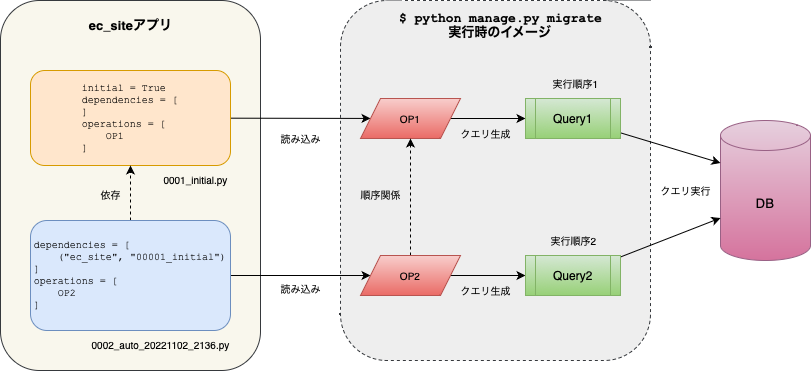
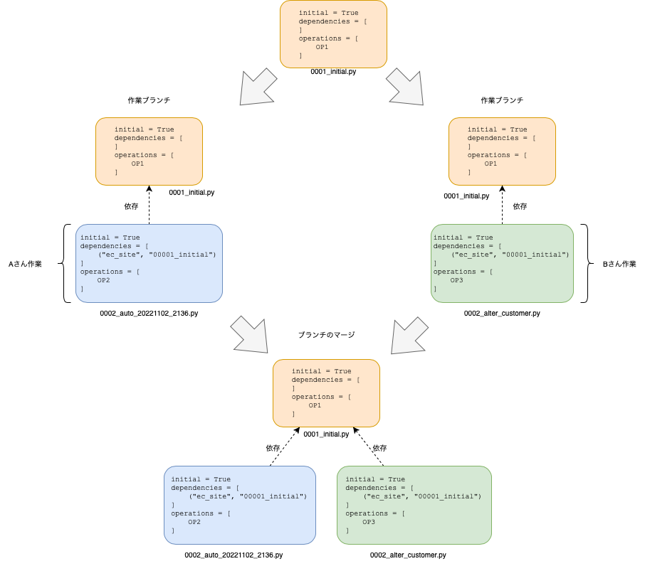

# Django Migration チュートリアル

## この発表の概要

目的: DjangoのMigration(以降単にMigrationと表記します)の基本的な使い方を説明する
対象者: Django初心者・初級者

## あなた is だれ?

金子亮佑(Ryosuke KANEKO)(a.k.a yamaneko)

### Work for

* Standard株式会社: Manager
* Artis株式会社: Backend Engineer

### Experiences

* 10+ years Django based app development
* 5+ years Django Rest Framework based API development
* 最初に触ったDjango -> 0.96
* (この半年はDjangoから離れて、大人の事情で赤い線路のフレームワークに触れてます、シュッシュッポッポッ🚃)

### Why Django(and DRF&DjangoFilter)?

「最小のコードで多くの機能が得られる」

* Model
* ModelForm
* GenericView
* Auth
* Admin
* [DjangoFilter] FilterSet
* [DRF] ModelSerializer
* [DRF] ModelViewSet

「Modelsが全体のベースとなっている」
「モデルとテーブルの同期も最小限のコストで機能的に行える」

## Migration機能 is 何


以下をまとめた機能

-   モデルの変更をDBのスキーマを反映させる仕組み
-   データを変更させる仕組み

詳細

- モデルに基づいたスキーマの反映・ロールバック
- スキーマの状態をVCSに保存
- 開発・ステージング・本番を選ばず使用可能
- Pythonコードを使用したデータの変更処理
- バックエンドを選ばず使用可能

<br>

## 歴史

Django 1.6までビルトインのMigration機能は存在しなかった

`python manaage.py syncdb` -> テーブルを作るだけ，スキーマの変更はできなかった

それまではSouthというサードパーティツールを使っていた

Django 1.7 からMigrationが組み込まれた

というか，まんまSouthがDjango組み込まれました．[^1]

[^1]: https://south.readthedocs.io/en/latest/releasenotes/1.0.html#library-migration-path  

## 基本的ワークフロー

### モデルを作成する

例: ECサイトアプリを作ります．

まず顧客をモデルに定義します．

```python:ec_site/models.py
from django.db import models  
  
  
class Customer(models.Model):  
    name = models.CharField('氏名', max_length=32)  
    email = models.EmailField('メールアドレス')  
    postal_code = models.CharField('郵便番号', max_length=8)  
    address = models.CharField('住所', max_length=128)  
  
    class Meta:  
        verbose_name = '顧客'  
        verbose_name_plural = verbose_name
```

モデルの変更をマイグレーションファイルに記録する．

```bash
$ python manage.py makemigrations
```

**ec_site/migrations/0001_initial.py**というmigrationファイル(pythonファイル)が作られます．

マイグレーションファイルに記録されている変更をSQL文で確認する．

```bash
$ python manage.py sqlmigrate ec_site 0001_init
```


### 最初のマイグレーションファイルを適用する
まずマイグレーションとデータベースの状態を確認しましょう．

```bash
$ python manage.py showmigrations
$ echo "show tables;"  | python manage.py dbshell
```

マイグレーションファイルを元に，データベースに変更を加えます

```bash
$ python manage.py migrate
```

データベースのテーブル状態を確認

```bash
$ python manage.py dbshell
MySQL [ec_site_devel]> show tables;
MySQL [ec_site_devel]> show create table ec_site_customer \G;
MySQL [ec_site_devel]> select * from ec_site_customer;
```

マイグレーションの状態を確認します

```bash
$ python manage.py showmigrations
```

### モデルに変更を加える(カラムを追加する)

電話番号カラムを追加します．

```python:ec_site/models.py
from django.db import models  
  
  
class Customer(models.Model):  
    name = models.CharField('氏名', max_length=32)  
    email = models.EmailField('メールアドレス')  
    postal_code = models.CharField('郵便番号', max_length=8)  
    address = models.CharField('住所', max_length=128)  
    tel = models.CharField('電話番号', max_length=11, blank=True)  
  
    class Meta:  
        verbose_name = '顧客'  
        verbose_name_plural = verbose_name
```

```bash
$ python manage.py makemigrations
```

**ec_site/migrations/0002_customer_tel.py**というマイグレーションファイルが作られます．マイグレーションの状態を確認しましょう．

```bash
$ python manage.py showmigrations
```
  
マイグレーションファイルを元に，データベースに変更を加えます

```bash
$ python manage.py migrate
```

-> データベースに変更がかかる

  
データベースのテーブル状態を確認


```bash
$ echo "select * from django_migrations"  | python manage.py dbshell
```

<!-- TODO: テーブルの中身を出す  -->

```bash
$ python manage.py showmigrations
```

<!-- TODO django_migrationsテーブルの中身を表示 -->
  
<!-- TODO: django_migrationテーブルの中身を出す  -->

### ここで押さえるべきポイント

* 開発者はモデルの定義のみ行う．テーブル・カラムの作成・変更(・削除)はマイグレーション機能が行う．
* モデル定義への変更はマイグレーションファイルとして記録される．
	* マイグレーションファイルはデータベースの状態を表すものではない．
* データベースに適用されたマイグレーションファイルの状態はデータベースに記録される．
	* ソースコードリポジトリはマイグレーションファイルの適用についての記録を持たない．

## マイグレーションファイルは何なのか?


### ファイル名 

`python manage.py makemigrations` によって自動的に命名される．

* 例1: `0001_initial.py`
* 例2: `0002_auto_20221102_1015.py`


4桁の通し番号の数字はフレームワークが自動的につけているので、目安程度の意味しかない．


```python:0002_auto_20221102_1015.py
class Migration(migrations.Migration):

    dependencies = [('migrations', '0001_initial')]

    operations = [
        migrations.DeleteModel('Tribble'),
        migrations.AddField('Author', 'rating', models.IntegerField(default=0)),
    ]
```
 
大まかな構造の説明

* initial: このマイグレーションがアプリの最初のマイグレーションかを示すフラグ
* dependencies: 依存するマイグレーションファイル(複数選択可)
* operations: 操作(例だと，モデルの削除とカラムの追加)

operationsはある時点でのモデルの状態を状態を示します．
常に一意のデータとして解釈できるよう、状態を**シリアライズして**ファイルに保存します．

マイグレーションファイルとマイグレーション処理の関係

* マイグレーションはDjangoアプリごとに管理される
* dependenciesから操作の順を示したグラフ構造が示される
* `$ python manage.py migrate`を実行すると、グラフ構造に沿って操作がデータベースに適用される

<br>

## 分岐のあるケース

<br>

この状態で`$ python manage.py migrate`するとエラーが出る．

```bash
$ pipenv run python manage.py migrate
CommandError: Conflicting migrations detected; multiple leaf nodes in the migration graph: (0002_auto_20221102_2136, 0002_alter_customer in ec_site).
To fix them run 'python manage.py makemigrations --merge'
```

マイグレーションの依存のグラフに葉(leaf)が出来ている状態なのでマージする

<br>

閉路が出来たグラフの場合、マイグレーションの直列化して処理を行う

<br>

## シリアライズ

変更の検出に使用

何と何が同じかを判定する

カスタムバリデータ、フィールド、ストレージを作るときは必要

毎回マイグレーションファイルが作られてしまう

## データマイグレーション

データの変更処理をマイグレーションで統合管理する

ケース例: 郵便番号カラムはハイフンが有る・無い形式が混在していたが、ハイフンがない形式に統一することになった

```bash
$ python manage.py makemigrations --empty ec_site
```

```python
from django.db import migrations

class Migration(migrations.Migration):

    dependencies = [
        ('ec_site', '0001_initial'),
    ]

    operations = [
    ]
```


```python
from django.db import migrations


def remove_hyphens(apps, schema_editor):
    Customer = apps.get_model('ec_site', 'Customer')
    for customer in Customer.objects.all():
        # Remove hyphens
        customer.postal_code = customer.postal_code.replace('-', '')
        customer.save()


class Migration(migrations.Migration):

    dependencies = [
        ('ec_site', '0001_initial'),
    ]

    operations = [
        migrations.RunPython(remove_hyphens),
    ]
```


## 操作

### `showmigrations`

### `migrate` - マイグレーションの適用

指定しないとすべてのアプリの未適用のマイグレーションを適用する

### `migrate app_label migration_name` - ロールバック

指定したマイグレーションの状態に戻す

### `makemigrations` - マイグレーションファイルの作成


## ワークフロー例

実際の開発におけるワークフロー

### 開発環境での作業

1. モデルに変更を加える

2. マイグレーションファイルを作る

```
python manage.py makemigrations
```

3. 作成されたマイグレーションファイルをVCSに登録する

4. マイグレーションを実行する

```
python manage.py migrate
```

5. 1〜4を必要に応じて繰り返す

### Staging/Productionデプロイ時の作業

1. WSGIサーバ(uwsgiなど)を停止させる

2. プログラムを更新する

3. マイグレーションを実行する

```
$ python manage.py migrate
```

4. WSGIサーバを起動する

※説明のためにシンプルな方法となります

## 避けるべき操作

既に適用されたマイグレーションファイルを書き換える

システム全体でのスキーマ・データの一貫性が失われる

## QA

Q: DBルーターに対応していますか?

Q: サーバを無停止でマイグレーションできますか?

できますが，

Q マイグレーションファイルの中でモデルに付けたメソッドを呼び出せません．

Q: sqlite


